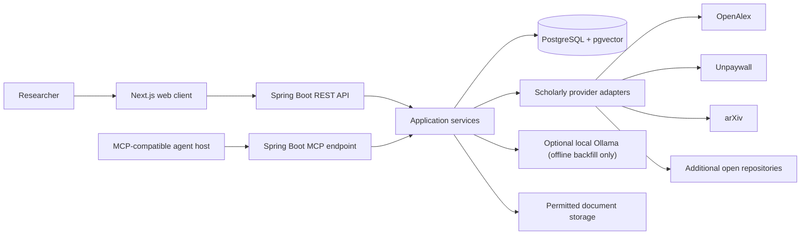
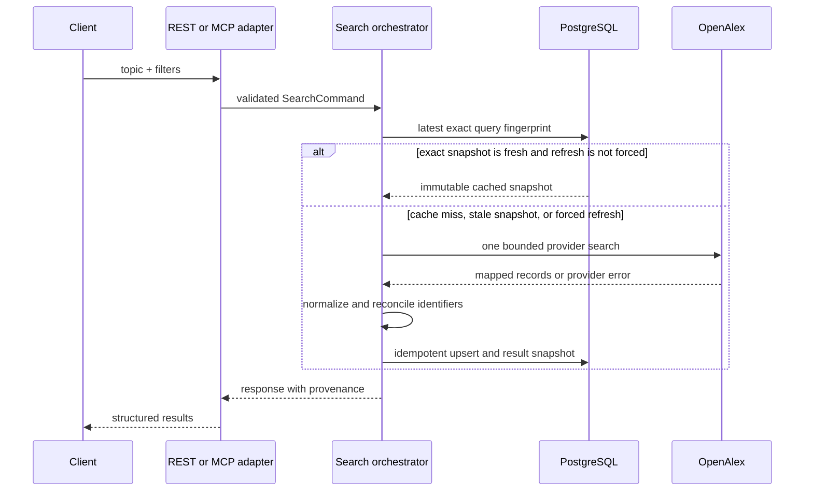

# Architecture

## System context



## Architectural style

The first release is a modular monolith deployed as one Spring Boot backend and one Next.js frontend. Backend modules communicate through Java interfaces and domain events, not network calls.

This provides one transaction boundary for normalization and persistence, low operational overhead, and clear module seams that can become services later if measured load requires it.

## Backend modules

Current package-level modules:

```text
com.openscholar
├── common                 # shared safe errors and boundary utilities
├── search                 # commands, exact-snapshot cache, OpenAlex orchestration
├── paper                  # canonical metadata, identifiers, authors, persistence
├── provider               # research-provider SPI plus OpenAlex adapter
├── access                 # legal-access resolution, URL verification, Unpaywall/arXiv clients
├── citation               # BibTeX and CSL-JSON rendering/export
├── library                # collections, reading status, tags, saved-paper lookup
├── embedding              # provider-neutral generation SPI plus pinned local Ollama adapter
├── jobs                   # explicit bounded embedding backfill and per-profile lease
├── mcp                    # five tool handlers and HTTP security boundary
├── api                    # Spring MVC controllers and request/response DTOs
└── persistence            # shared persistence configuration
```

`security` currently contains a boundary placeholder. The `paper` module owns provider-neutral embedding-profile and vector-store primitives; `embedding` supplies a disabled-by-default local generator; and `jobs` supplies the explicit maintenance backfill. Semantic product ranking, recurring job scheduling, MCP resources, generated OpenAPI models, and hosted authentication remain planned. Package boundaries are verified with ArchUnit. Domain modules must not depend on web controllers or provider implementations.

## Search request flow



## Cache decision

A query fingerprint is calculated from normalized topic text and sorted filters. The current orchestrator reuses an exact fresh fingerprint unless refresh is forced. It evaluates:

- freshness of the exact search snapshot;
- explicit user refresh requests.

Otherwise it performs one OpenAlex search, persists a new immutable snapshot, or returns the latest exact stale snapshot when OpenAlex fails. A bounded 64-stripe coordinator rechecks the exact cache inside the same-instance critical section before provider access and persistence, so concurrent ordinary misses for the same fingerprint share the leader's new snapshot. Explicit forced refreshes retain their provider-fetch semantics after waiting. This coordination is intentionally JVM-local; multi-instance duplicate suppression would require a distributed lease or database protocol. Responses expose `searchedAt`, `freshUntil`, cache disposition, and provider coverage. A web continuation posts the current snapshot ID; the server reconstructs its persisted criteria and searches with only the stored opaque next cursor changed, producing another independently cacheable immutable snapshot. Related-topic local/full-text/vector reuse and coverage-based provider fan-out remain planned.

## Provider adapters

Each provider implements a shared interface conceptually equivalent to:

```java
interface ResearchProvider {
    ProviderId id();
    ProviderSearchResult search(ProviderSearchQuery query);
}
```

The current OpenAlex adapter owns authentication, pagination, bounded response handling, rate-limit metadata, response mapping, and error translation. It returns provider records and never writes directly to canonical paper tables. Unpaywall and arXiv are separate exact-identifier clients inside access resolution.

Implemented resilience:

- connection and response timeouts;
- bounded provider response bodies;
- upstream `429`/retry metadata translation;
- exact search caching/stale fallback;
- bounded same-instance coordination for identical ordinary searches;
- isolation of Unpaywall and arXiv access-provider outcomes.

Limited retries, exponential backoff with jitter, provider concurrency budgets, circuit breakers, bulkheads, cross-instance request coalescing, and multi-provider search partial results remain planned.

## Canonicalization and deduplication

Current records are reconciled by normalized DOI, arXiv ID, OpenAlex ID, and provider-record identity. The planned catalog-hardening order extends that with:

1. Normalized DOI equality.
2. arXiv identifier equality, ignoring version suffix where appropriate.
3. OpenAlex work ID equality.
4. Planned: exact normalized title plus publication year and first author.
5. Planned: conservative fuzzy candidate generation backed by evaluation thresholds.

Current canonical data retains record-level provenance and identifies the provider record selected for canonical authorship; it does not yet retain field-level attribution. Field-level provenance and documented conflict-resolution rules remain catalog-hardening work.

## Ranking

The current OpenAlex slice persists the provider relevance score and returns an `OPENALEX_RELEVANCE` reason. A separate live related-paper path now provides the first local PostgreSQL full-text baseline: title, abstract, and venue receive A/B/C weights, `ts_rank_cd` supplies the score, deterministic metadata tie-breakers stabilize the order, and the API reports `POSTGRES_FULL_TEXT`. It remains separate from immutable provider snapshots. The `V10` embedding foundation is not connected to this path. A planned hybrid ranker may add measured semantic similarity and additional feature weights only after comparison against the versioned relevance fixture.

## Embedding boundary

`PaperEmbeddingStore` is an application-facing persistence boundary inside the `paper` module. It registers immutable vector-space profiles, renders versioned source input, rejects a save when canonical content changed during generation, performs idempotent vector upserts, pages papers missing a profile, and returns exact cosine neighbors only within one profile. PostgreSQL owns the vector-dimension and profile-integrity constraints.

Title/abstract input-policy v1 is deterministic: `Title: <title>\nAbstract: <abstract or empty>`, stripped fields, LF line endings, Unicode NFC, a 24 KiB UTF-8 rejection bound, and a SHA-256 checksum over the exact bytes. A title or abstract update invalidates the derived vectors at the database boundary.

The first inference implementation is a direct Spring AI/Ollama adapter for the exact `qwen3-embedding:0.6b` tag at 1024 dimensions and Ollama `0.31.1`. It is absent unless explicitly enabled, accepts only a numeric loopback HTTP endpoint, bypasses system proxies, refuses redirects, caps responses at 2 MiB, and requires an operator confirmation that cloud features were disabled on the server. It verifies the runtime, full artifact digest, installed tag/capability/context/dimensions, disables truncation, and rejects output if either the runtime or digest changes during inference. It never pulls a model. The immutable key and revision both include the full digest and runtime version so different artifacts or runtimes cannot share a vector space. OpenAI `text-embedding-3-large` shortened to 1024 remains a separate future opt-in evaluation adapter. Equal dimensions do not make two model profiles interoperable.

`EmbeddingBackfillUseCase` is the only executable generation path. One invocation takes an exclusive cursor and a `1..500` limit, acquires a PostgreSQL session advisory lock scoped to the immutable profile, verifies/registers the generator, and processes one missing-vector page. The advisory lease consumes one pooled connection, so at least two are required. Source preparation and checksum-guarded storage use their own short transactions; model inference occurs without a database transaction. Retryable verification/generation failures and source-change races have a shared `1..3` attempt bound. Systemic provider or profile failures abort the run; deleted or oversized papers and permanent input-specific failures are reported per paper. The opt-in `ApplicationRunner` exists only in a non-web application, and a web-startup guard rejects an enabled backfill before generation. Lock contention or any reported paper failure makes the maintenance process exit nonzero after safe summary logs.

The related-paper endpoint remains database-only. Future vector/hybrid reads may consume precomputed source and candidate vectors, but may not invoke an inference provider. Missing or invalidated vectors fall back to the current full-text result. This keeps local-provider availability and hosted credentials outside interactive-read correctness.

## Persistence

- Spring Data JPA for transactional aggregate persistence.
- Implemented JDBC/native query for PostgreSQL full-text related-paper retrieval.
- Implemented provider-neutral pgvector profile/storage, missing-work paging, exact same-profile cosine operations, and an explicit offline population job; HNSW and product ranking remain planned.
- Flyway as the only production schema-change mechanism.
- PostgreSQL session advisory lock for same-profile embedding backfill; durable/scheduled job leases remain planned.
- JSONB for bounded provenance fragments; core searchable data remains normalized.

## MCP architecture

The backend exposes a stateless Streamable HTTP endpoint at `/mcp` using the Spring AI WebMVC starter. Five annotation-registered, read-oriented handlers delegate to the same application services used by REST. WebMVC plus Java 21 virtual threads fits the blocking JPA path.

Stateless mode suits the MVP's bounded request/response tools and horizontal scaling. Search is the only initial MCP tool allowed to contact an external provider; legal-access retrieval is stored-only so it cannot overrun the interactive transport deadline. Longer operations will return owned job handles (`start_research_job`, `get_research_job`) rather than holding sessions. Stateful Streamable HTTP is a later option if progress, elicitation, or server-to-client features become essential. STDIO may be added as a local profile; deprecated HTTP+SSE is not a target.

Spring AI 2.0 and MCP Java SDK 2.0 negotiate their supported legacy revisions through `2025-11-25`. OpenScholar records `2025-11-25` as its maximum tested revision and does not hand-build newer Tasks/Apps features before official Java/Spring support exists.

## Deployment

### Local/MVP

- `frontend` container
- `backend` container
- `postgres` container with pgvector
- no Ollama container or hosted embedding credential in Compose; optional local generation is a direct backend maintenance workflow against a separately installed loopback Ollama process
- planned optional object-storage profile for legally permitted documents; no MinIO service is defined today

### Hosted portfolio deployment

- managed PostgreSQL with pgvector;
- backend/frontend container services;
- S3-compatible storage only when retention policy permits;
- edge TLS/reverse proxy;
- OAuth 2.0 resource-server protection for MCP and user APIs.

Extract ingestion workers only when background work measurably competes with interactive latency or requires independent scaling.

## Observability

Current:

- Ordinary SLF4J application logs with sanitized MCP failure logging and MCP request IDs in logging context.
- Spring Boot Actuator `health`/`info` plus internal Micrometer counters and timing for the MCP security boundary.

Planned:

- Structured JSON logs and OpenTelemetry traces for REST, MCP, database, and provider calls.
- Broader metrics for latency, cache hits, provider health, result counts, merges, access verification, and job lag.
- Correlation IDs in REST Problem Details.
