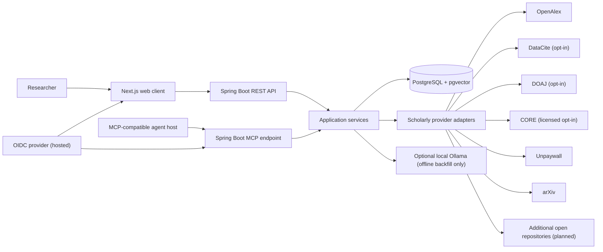
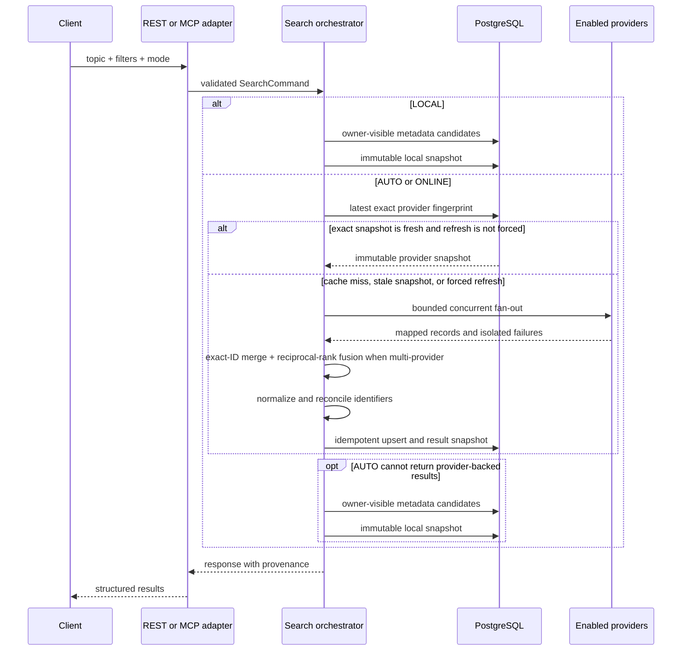

# Architecture

## System context



## Architectural style

The first release is a modular monolith deployed as one Spring Boot backend and one Next.js frontend. Backend modules communicate through Java interfaces and domain events, not network calls.

This provides one transaction boundary for normalization and persistence, low operational overhead, and clear module seams that can become services later if measured load requires it.

## Browser installation and offline boundary

The production frontend registers a small service worker that makes the site installable without caching application state. It precaches an account-neutral fallback and fixed install assets; manifest and icon requests are network-first with a cached fallback. Queryless, same-origin `/_next/static/` build assets are cache-first and limited to 96 runtime entries. The allowlist excludes successful HTML/RSC responses, `/api`, direct REST, MCP, authentication, OAuth metadata, exports, cross-origin traffic, ranges, and research-document extensions. Successful eligible navigations remain network-first and refresh the neutral fallback in the background; an eligible navigation whose network fetch rejects receives only that fallback. PostgreSQL remains authoritative and no search result, library record, privacy export, session material, or PDF byte is written to CacheStorage. The `/data` privacy center reaches the existing owner-scoped export/delete use cases through no-store same-origin BFF routes; successful hosted deletion also expires the OpenScholar application session.

The global connectivity notice treats `navigator.onLine` only as an advisory browser signal. When it reports offline, the UI makes a bounded, same-origin, `no-store`, credentialless request to `/api/connectivity`, which bypasses hosted session refresh and succeeds only when the Next.js route can reach an `UP` Spring Boot backend. AUTO and LOCAL submissions remain enabled during that initial advisory check and when the self-hosted/local stack is reachable; the UI instead warns that online research sources may be limited. Confirmed application unreachability disables those server-backed search actions. **Check again** or a returning browser signal starts a recovery probe after transient failure, but actions resume and assistive technology receives a recovery announcement only after that probe succeeds. UI copy reports application reachability rather than asserting Internet state. The probe does not infer individual scholarly-provider health, cache its result, or queue a mutation for later replay. See [ADR 0007](decisions/0007-use-an-account-neutral-pwa-shell.md).

## Backend modules

Current package-level modules:

```text
com.openscholar
├── common                 # shared safe errors and boundary utilities
├── search                 # owner-scoped provider/local snapshots, fan-out, ranking, deadlines
├── paper                  # canonical metadata, identifiers, authors, persistence
├── provider               # research-provider SPI plus discovery adapters
├── access                 # legal-access resolution, URL verification, Unpaywall/arXiv clients
├── citation               # BibTeX and CSL-JSON rendering/export
├── library                # collections, reading status, tags, saved-paper lookup
├── embedding              # provider-neutral generation SPI plus pinned local Ollama adapter
├── jobs                   # offline embedding backfill plus durable metadata/access refresh leases
├── privacy                # owner-scoped personal-data export and deletion
├── security               # local identity or OIDC principal/JWT/scope boundary
├── mcp                    # six tool handlers and HTTP security boundary
├── api                    # Spring MVC controllers and request/response DTOs
└── persistence            # shared persistence configuration
```

The `paper` module owns provider-neutral embedding-profile and vector-store primitives plus the default-off related-paper hybrid read; `embedding` supplies a disabled-by-default local generator. `jobs` contains both the explicit non-web embedding backfill and PostgreSQL-backed refresh jobs for search metadata/access evidence. `security` selects a fixed local owner when OIDC is off and issuer/subject-backed principals when hosted OIDC is on. Package boundaries are verified with ArchUnit. MCP resources, generated OpenAPI models, notes/highlights, and broader semantic reuse remain planned.

## Search request flow



## Cache decision

The mode-aware v2 query fingerprint is calculated from normalized topic text, sorted filters, requested mode, and the enabled-provider set. Local retrieval uses a separate `local-catalog-v1` pipeline without an invented provider set. Keeping `AUTO` and `ONLINE` fingerprints distinct lets each immutable snapshot resource report one stable requested mode. Snapshots and continuation reads are scoped to the current user and persist requested mode plus `PROVIDER` or `LOCAL_CATALOG` result origin; two principals may have the same fingerprint without sharing private search history. Legacy v1 snapshots remain readable and manually refreshable but are excluded from automatic stale-target scheduling. `AUTO` is the default, `ONLINE` forbids local-catalog fallback, and `LOCAL` is database-only and rejects forced refresh. The orchestrator reuses an exact fresh owner/fingerprint/origin entry where applicable. It evaluates:

- freshness of the exact search snapshot;
- explicit user refresh requests.

Otherwise the provider path invokes enabled discovery providers concurrently, persists a new immutable snapshot from all successful results, or returns the latest exact stale provider snapshot if no provider succeeds. `AUTO` may then execute owner-scoped local-catalog retrieval; `ONLINE` never does, while `LOCAL` bypasses the provider path entirely. Local eligibility requires a paper to have appeared in that owner's earlier snapshot or saved collection. Local execution has empty provider coverage but retains deterministic stored provider provenance and its retrieval time for each result. Its opaque, query-bound cursor carries a bounded remainder of the first page's ranked paper IDs, so catalog growth cannot shift later pages; owner visibility is checked again when each page is hydrated. Continuation of a local snapshot remains local after reconnection.

Individual provider failures remain coverage/warning entries and do not erase useful results. Exact identifiers reconcile duplicates; multi-provider result sets use deterministic reciprocal-rank fusion and retain every contributing provider. A bounded 64-stripe coordinator rechecks the owner-scoped exact provider cache inside the same-instance critical section before provider access and persistence, so concurrent ordinary misses for the same owner/fingerprint share the leader's new snapshot. Lock acquisition has a configurable 12-second default limit; it does not time work after acquisition or cancel the leader. On timeout, the orchestrator rechecks the latest exact provider snapshot: a normal caller may return a newly fresh `EXACT_HIT`, while any other available snapshot becomes `STALE_FALLBACK` with `SEARCH_COORDINATION_TIMEOUT`. If no provider snapshot exists, `AUTO` may still use the owner-scoped local catalog; `ONLINE` and forced refresh preserve their provider-only semantics and return the retryable public timeout error. This coordination is intentionally JVM-local; cross-instance request coalescing remains external work. Responses expose `requestedMode`, actual `executionSource`, freshness, cache disposition, provider coverage/contributions, warnings, and an opaque mode-specific cursor.

An outer `SearchExecutionDeadline` runs every `SearchResearchUseCase` `search`, `next`, and `get` operation on a context-propagating virtual-thread worker with a configurable 18-second default. Its monotonic budget covers application dispatch through cache, coordination, provider/deserialization, persistence, and final `SearchView` construction. On expiration it marks cancellation, interrupts the worker, and uses cooperative checkpoints before and after blocking boundaries. The deadline is terminal and takes precedence when it fires first, so the orchestrator does not initiate a new stale fallback after expiration; inner OpenAlex and coordination outcomes retain precedence when they finish first. The deadline cannot guarantee cancellation of JDBC persistence already in progress; its transaction may continue and commit, so a new immutable snapshot may later become visible. Parsing/schema validation, REST/MCP DTO and framework serialization, socket lifetime, client disconnects, and MCP cancellation notifications remain outside this application boundary.

## Provider adapters

Each provider implements a shared interface conceptually equivalent to:

```java
interface ResearchProvider {
    ProviderId id();
    ProviderSearchResult search(ProviderSearchQuery query);
}
```

The default OpenAlex adapter owns authentication, pagination, bounded response handling, rate-limit metadata, response mapping, and error translation. The disabled-by-default DataCite adapter performs keyless thesis/dissertation metadata discovery across modern controlled and legacy free-text resource types. It uses relevance page cursors owned by OpenScholar, returns canonical DOI links, and deliberately sets both PDF and open-access claims to false; `openAccessOnly` requests are skipped until the exact-DOI access pipeline can verify them. DataCite does not download a document or follow an upstream continuation URL.

The disabled-by-default DOAJ adapter adds keyless v4 article discovery from DOAJ's open-access index. It treats DOAJ's status as a source-reported access claim, maps only typed metadata and reported links, ignores upstream continuation URLs in favor of a locally validated opaque page cursor, and never downloads article bytes. Because DOAJ's search results do not provide citation counts and journal language is not necessarily article language, that adapter skips citation-threshold and language-filtered queries instead of silently weakening them.

The disabled-by-default CORE API v3 adapter is absent unless an operator also confirms that an applicable licence and the current terms have been reviewed. An optional API key is backend-only Bearer authentication. The adapter searches work metadata with bounded paging, translates CORE rate-limit signals, and accepts both documented response naming variants. It intentionally discards full text and download URLs, never calls CORE's document-download endpoints, never emits a discovery PDF URL, and treats a provider-reported full-text signal only as unverified provenance. It does not scrape CORE or write directly to canonical paper tables.

All four discovery adapters have configurable whole-exchange deadlines and streamed response limits; their 10-second and 8 MiB defaults cover request transmission, response headers, and body consumption before JSON deserialization. These deadlines are outbound-provider boundaries: they do not include local coordination waits, database/persistence work, final REST/MCP serialization, or the full request. Adapters return provider records and never write directly to canonical tables. Unpaywall and arXiv remain separate exact-identifier clients inside access resolution.

Implemented resilience:

- configurable whole-exchange deadlines for enabled discovery adapters plus bounded access-provider timeouts;
- bounded provider response bodies;
- upstream `429`/retry metadata translation;
- exact search caching/stale fallback;
- configurable, bounded same-instance lock acquisition for search coordination;
- a shared configurable search application-execution deadline with interrupting cancellation and cooperative checkpoints;
- concurrent provider fan-out, partial-success persistence, combined opaque cursors, deterministic fusion, and provider metrics;
- isolation of Unpaywall and arXiv access-provider outcomes.

General automatic retries, jittered backoff, circuit breakers/bulkheads, cross-instance request coalescing, client-disconnect and MCP-notification cancellation propagation, and transport parsing/serialization/socket deadlines remain planned. Durable refresh jobs implement bounded retry/backoff for their owned workflow; that is not a general interactive-provider retry policy.

## Canonicalization and deduplication

Current records are reconciled by normalized DOI, arXiv ID, OpenAlex ID, and provider-record identity. The planned catalog-hardening order extends that with:

1. Normalized DOI equality.
2. arXiv identifier equality, ignoring version suffix where appropriate.
3. OpenAlex work ID equality.
4. Planned: exact normalized title plus publication year and first author.
5. Planned: conservative fuzzy candidate generation backed by evaluation thresholds.

Current canonical data retains record-level provenance and identifies the provider record selected for canonical authorship; it does not yet retain field-level attribution. Field-level provenance and documented conflict-resolution rules remain catalog-hardening work.

## Ranking

Single-provider discovery pages retain their provider ranking signal; OpenAlex records expose `OPENALEX_RELEVANCE`. When more than one discovery provider succeeds, deterministic reciprocal-rank fusion orders the exact-identifier-merged page and preserves each provider contribution. A separate live related-paper path provides the local PostgreSQL full-text baseline: title, abstract, and venue receive A/B/C weights, `ts_rank_cd` supplies the score, and deterministic metadata tie-breakers stabilize the order. A default-off production-readiness mode unions bounded lexical candidates with bounded candidates from the pinned `V11` HNSW index, verifies exact vector coverage for every lexical candidate, and applies the frozen 50/50 lexical/clamped-cosine scorer. The API reports typed ranking mode, fallback reason, and feature values. This path remains separate from immutable provider snapshots.

## Embedding boundary

`PaperEmbeddingStore` is an application-facing persistence boundary inside the `paper` module. It registers immutable vector-space profiles, renders versioned source input, rejects a save when canonical content changed during generation, performs idempotent vector upserts, pages papers missing a profile, and returns exact cosine neighbors only within one profile. PostgreSQL owns the vector-dimension and profile-integrity constraints.

Title/abstract input-policy v1 is deterministic: `Title: <title>\nAbstract: <abstract or empty>`, stripped fields, LF line endings, Unicode NFC, a 24 KiB UTF-8 rejection bound, and a SHA-256 checksum over the exact bytes. A title or abstract update invalidates the derived vectors at the database boundary.

The first inference implementation is a direct Spring AI/Ollama adapter for the exact `qwen3-embedding:0.6b` tag at 1024 dimensions and Ollama `0.31.1`. It is absent unless explicitly enabled, accepts only a numeric loopback HTTP endpoint, bypasses system proxies, refuses redirects, caps responses at 2 MiB, and requires an operator confirmation that cloud features were disabled on the server. It verifies the runtime, full artifact digest, installed tag/capability/context/dimensions, disables truncation, and rejects output if either the runtime or digest changes during inference. It never pulls a model. The immutable key and revision both include the full digest and runtime version so different artifacts or runtimes cannot share a vector space. OpenAI `text-embedding-3-large` shortened to 1024 remains a separate future opt-in evaluation adapter. Equal dimensions do not make two model profiles interoperable.

`EmbeddingBackfillUseCase` is the only executable generation path. One invocation takes an exclusive cursor and a `1..500` limit, acquires a PostgreSQL session advisory lock scoped to the immutable profile, verifies/registers the generator, and processes one missing-vector page. The advisory lease consumes one pooled connection, so at least two are required. Source preparation and checksum-guarded storage use their own short transactions; model inference occurs without a database transaction. Retryable verification/generation failures and source-change races have a shared `1..3` attempt bound. Systemic provider or profile failures abort the run; deleted or oversized papers and permanent input-specific failures are reported per paper. The opt-in `ApplicationRunner` exists only in a non-web application, and a web-startup guard rejects an enabled backfill before generation. Lock contention or any reported paper failure makes the maintenance process exit nonzero after safe summary logs.

The related-paper endpoint remains database-only. Its opt-in hybrid read consumes only precomputed pinned-profile vectors and never invokes an inference provider. A missing profile/source vector or incomplete lexical-candidate coverage returns the already-read full-text result with a typed reason; unrelated database or operational failures propagate. This keeps local-provider availability and hosted credentials outside interactive-read correctness.

## Persistence

- Spring Data JPA for transactional aggregate persistence.
- Implemented JDBC/native query for PostgreSQL full-text related-paper retrieval.
- Implemented provider-neutral pgvector profile/storage, missing-work paging, exact same-profile cosine operations, the pinned partial/expression HNSW index, exact scoring for bounded candidate IDs, an explicit offline population job, and a default-off hybrid related-paper read.
- Flyway as the only production schema-change mechanism.
- PostgreSQL session advisory lock for same-profile embedding backfill.
- Durable `PAPER_ACCESS` and `SEARCH_METADATA` refresh rows with active-target deduplication, `SKIP LOCKED` claims, expiring lease tokens, bounded exponential retry, terminal safe errors, optional stale-target scheduling, REST inspection, and manual retry. Worker and scheduler are default-off.
- JSONB for bounded provenance fragments; core searchable data remains normalized.

## MCP architecture

The backend exposes a stateless Streamable HTTP endpoint at `/mcp` using the Spring AI WebMVC transport. Six annotation-derived, read-oriented specifications delegate to the same application services used by REST. A project-owned registration boundary retains Spring's generated input/output schemas and annotations while replacing the default exception rendering with safe OpenScholar tool results. WebMVC plus Java 21 virtual threads fits the blocking JPA path.

Stateless mode suits the bounded request/response tools and horizontal scaling. Search is the only MCP tool allowed to contact discovery providers; `search_research(mode=LOCAL)`, exact-identifier resolution, and legal-access retrieval are stored-only. Exact DOI, arXiv, and OpenAlex lookup is limited to canonical papers already visible through the current owner's search snapshots or collections, so the shared catalog cannot be enumerated; [ADR 0008](decisions/0008-owner-scoped-exact-identifier-resolution.md) records that boundary. Provider-backed search results expose every contribution retained by their snapshot; local execution exposes one deterministic stored provider record without inventing local provenance. The search tool's static MCP annotations remain conservative because AUTO/ONLINE can access the open world and every newly executed mode stores a snapshot. Local deployment uses an explicit loopback MCP bearer key and fixed owner. OIDC mode uses Spring Security's stateless JWT resource server, validates signature/time/issuer/audience, requires `openscholar.mcp`, derives the owner from issuer+subject, rate-limits on a hashed principal identity, and publishes RFC 9728-style protected-resource metadata at `/.well-known/oauth-protected-resource/mcp`. Inbound bearer tokens are never forwarded to scholarly providers.

The project-owned stateless server disables only the SDK's outer tool-input validator, closes every generated input schema to additional properties, and immediately applies that schema inside the safe callback before Java argument conversion or application dispatch. This preserves strict required/type/enum/additional-property validation while preventing framework validation strings from becoming the public error contract. The callback also validates successful `structuredContent` against the advertised output schema before returning it, so schema drift becomes the generic safe error rather than an SDK diagnostic. Domain exceptions map by class to fixed descriptors; raw exception messages and causes are never copied. Tool errors return one safe text item, `isError=true`, and versioned metadata under `_meta["com.openscholar/error"]`, with no error `structuredContent`; successful structured output and its advertised schema are unchanged. Protocol and HTTP transport failures remain outside this mapper. See [ADR 0009](decisions/0009-versioned-safe-mcp-tool-errors.md).

The configured MCP SDK request timeout still does not provide whole-tool cancellation. Discovery-provider exchange deadlines, the 12-second coordination limit, and the 18-second search application deadline bound their own layers, but framework parsing/serialization, socket lifetime, client disconnects, and `notifications/cancelled` do not cancel the tool worker. Durable refresh jobs are REST operations and are not MCP Tasks or owned MCP job handles.

Spring AI 2.0 and MCP Java SDK 2.0 negotiate their supported legacy revisions through `2025-11-25`. OpenScholar records `2025-11-25` as its maximum tested revision and does not hand-build newer Tasks/Apps features before official Java/Spring support exists.

## Deployment

### Local/MVP

- `frontend` container
- `backend` container
- `postgres` container with pgvector
- no Ollama container or hosted embedding credential in Compose; optional local generation is a direct backend maintenance workflow against a separately installed loopback Ollama process
- planned optional object-storage profile for legally permitted documents; no MinIO service is defined today

### Hosted portfolio deployment

- The repository contains a hardened single-host Compose template with PostgreSQL/pgvector, backend, Next.js, Caddy TLS edge, segmented internal networks, file-backed secrets, non-root/read-only services, resource/log bounds, and an optional Prometheus/Alertmanager/blackbox-exporter observability profile. Checked-in scratch-runtime builds replace the vulnerable official Caddy and blackbox-exporter runtime images. A checked image-policy wrapper validates every resolved profiled service immediately before deployment commands.
- Production Compose is fail-closed on OIDC configuration. Spring Boot is the JWT resource server; Next.js is an authorization-code/PKCE BFF that validates ID tokens and keeps encrypted access/refresh/ID-token state in `__Host-` HttpOnly cookies before forwarding access tokens server-to-server. The secret-reading frontend entrypoint is executable content baked into the application image, not a deployment bind mount.
- Guarded PostgreSQL custom-format backup and restore scripts provide checksum validation and optional `age` encryption; they do not upload, rotate, or prove restore success automatically.
- These are deployment artifacts, not evidence of a running cloud service. The example deliberately blocks deployment until backend, frontend, Caddy, and blackbox-exporter are CI-built, pushed to their approved project repositories, rescanned by registry digest, signed/attested, and pinned. Managed PostgreSQL/PITR, public DNS/ingress, identity-provider registration, a real alert receiver, secret management, and operational evidence remain deployment decisions.
- No object-storage service or PDF retention path exists.
- The frontend image includes the versioned service worker and install assets; `/sw.js` is revalidated and successful user pages remain network-only.

Extract ingestion workers only when background work measurably competes with interactive latency or requires independent scaling.

## Observability

Current:

- Ordinary SLF4J application logs with sanitized MCP failure logging and MCP request IDs in logging context.
- Spring Boot Actuator `health`/`info` plus a Prometheus registry containing bounded-cardinality HTTP, search/cache, MCP-boundary, provider, and durable refresh-job counters/timers.
- Production Compose moves Actuator to a private `9091` management listener on the monitoring network; Prometheus scrapes it directly while Caddy exposes no management route.
- Optional blackbox Prometheus/Alertmanager artifacts for internal readiness, frontend, PostgreSQL TCP, public HTTPS, probe health, latency, and certificate expiry, plus application-meter alerts. The checked-in Alertmanager receiver is intentionally a no-op.

Planned:

- Structured JSON logs and OpenTelemetry traces for REST, MCP, database, and provider calls.
- Broader metrics for access verification, queue depth/lag, database pools, and principal/aggregate rate limits.
- Correlation IDs in REST Problem Details.
