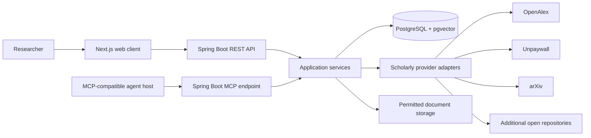
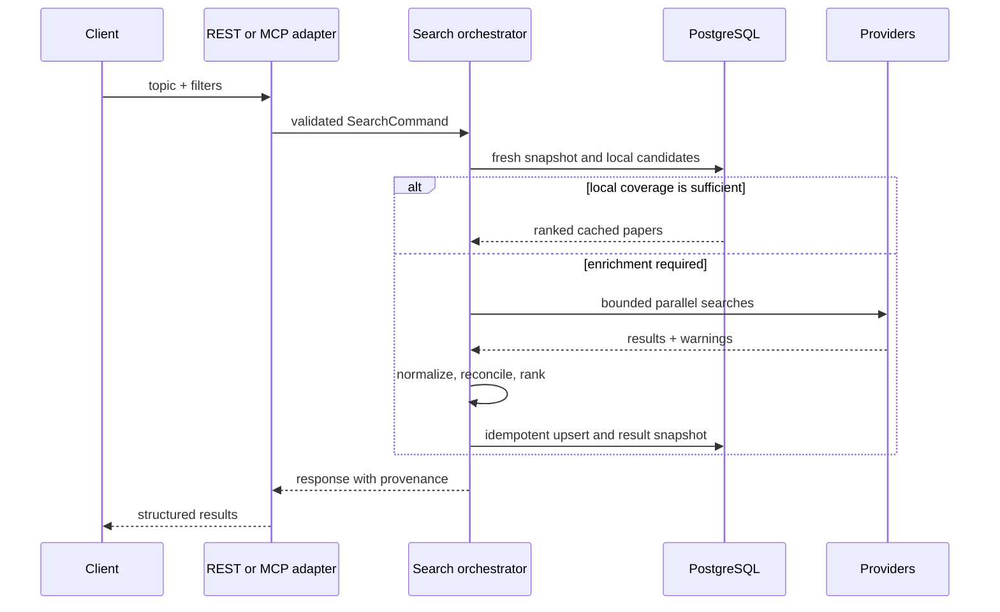

# Architecture

## System context



## Architectural style

The first release is a modular monolith deployed as one Spring Boot backend and one Next.js frontend. Backend modules communicate through Java interfaces and domain events, not network calls.

This provides one transaction boundary for normalization and persistence, low operational overhead, and clear module seams that can become services later if measured load requires it.

## Backend modules

```text
com.openscholar
├── common                 # errors, identifiers, clock, pagination, tracing
├── search                 # query model, cache policy, orchestration, ranking
├── paper                  # canonical paper aggregate, versions, authors, topics
├── provider               # provider SPI and concrete adapters
│   ├── openalex
│   ├── unpaywall
│   └── arxiv
├── access                 # legal full-text resolution and URL verification
├── library                # collections, reading status, notes, exports
├── semantic               # embeddings and vector retrieval (post-MVP)
├── mcp                    # MCP tools/resources and result mapping
├── api                    # REST controllers and OpenAPI models
├── jobs                   # refresh, enrichment, verification, retry handling
├── security               # authentication, authorization, audit policy
└── persistence            # JPA/JDBC repositories and database mappings
```

Package boundaries will be verified with ArchUnit. Domain modules must not depend on web controllers or provider implementations.

## Search request flow



## Cache decision

A query fingerprint is calculated from normalized topic text and sorted filters. An exact fresh fingerprint is a strong cache hit. Related-topic retrieval searches paper full text and, later, embeddings. The orchestrator evaluates:

- freshness of the exact search snapshot;
- number and score distribution of eligible local candidates;
- whether requested providers/date ranges were previously covered;
- explicit user refresh requests.

External lookup occurs if coverage is insufficient. Responses expose `searchedAt`, `freshUntil`, cache disposition, and provider coverage.

## Provider adapters

Each provider implements a shared interface conceptually equivalent to:

```java
interface ResearchProvider {
    ProviderId id();
    ProviderSearchResult search(ProviderSearchQuery query);
    Optional<ProviderPaperRecord> fetch(ExternalPaperId id);
    ProviderCapabilities capabilities();
}
```

Adapters own authentication, pagination, rate-limit headers, response mapping, and error translation. They return provider records and never write directly to canonical paper tables.

Resilience rules:

- connection and response timeouts;
- limited retries only for safe transient failures;
- exponential backoff with jitter;
- provider concurrency limits, circuit breakers, and bulkheads;
- request coalescing for identical in-flight queries;
- partial-result semantics.

## Canonicalization and deduplication

Records are reconciled in order:

1. Normalized DOI equality.
2. arXiv identifier equality, ignoring version suffix where appropriate.
3. OpenAlex work ID equality.
4. Exact normalized title plus publication year and first author.
5. Conservative fuzzy candidate generation backed by evaluation thresholds.

Canonical data retains field-level provenance. Conflicting values are selected through documented provider priority and completeness rules rather than silently discarded.

## Ranking

The initial ranker is deterministic and explainable. Features include lexical relevance, filter match, open-full-text availability, age-normalized citation impact, requested recency, metadata completeness, and source/version confidence. The API returns feature-level reasons. Semantic similarity is added only after an evaluation set exists.

## Persistence

- Spring Data JPA for transactional aggregate persistence.
- JDBC/native queries for PostgreSQL full-text and pgvector operations.
- Flyway as the only production schema-change mechanism.
- PostgreSQL job leases/advisory locks for scheduled work.
- JSONB for bounded provenance fragments; core searchable data remains normalized.

## MCP architecture

The backend exposes a stateless Streamable HTTP MCP endpoint at `/mcp` using the Spring AI WebMVC starter. Annotation-registered handlers delegate to the same application services used by REST. WebMVC plus Java 21 virtual threads fits the blocking JPA and document-processing path.

Stateless mode suits the MVP's bounded request/response tools and horizontal scaling. Long operations will return job handles (`start_research_job`, `get_research_job`) rather than holding sessions. Stateful Streamable HTTP is a later option if progress, elicitation, or server-to-client features become essential. STDIO may be added as a local profile; deprecated HTTP+SSE is not a target.

At planning time, Spring AI 2.0 and MCP Java SDK 2.0 implement MCP revision `2025-11-25`, while the latest specification is newer. The server will advertise and test the supported revision and will not hand-build newer Tasks/Apps features before official Java support exists.

## Deployment

### Local/MVP

- `frontend` container
- `backend` container
- `postgres` container with pgvector
- optional `minio` profile for legally permitted documents

### Hosted portfolio deployment

- managed PostgreSQL with pgvector;
- backend/frontend container services;
- S3-compatible storage only when retention policy permits;
- edge TLS/reverse proxy;
- OAuth 2.0 resource-server protection for MCP and user APIs.

Extract ingestion workers only when background work measurably competes with interactive latency or requires independent scaling.

## Observability

- Structured JSON logs.
- Spring Boot Actuator and Micrometer metrics.
- OpenTelemetry traces for REST, MCP, database, and provider calls.
- Metrics for latency, cache hits, provider health, result counts, merges, access verification, job lag, and MCP outcomes.
- Correlation IDs in safe error responses.
