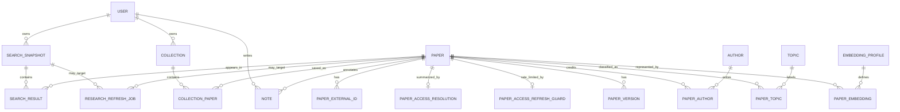

# Data Model

## Principles

- A scholarly work is distinct from provider records and accessible versions.
- Identifiers are normalized before uniqueness checks.
- Externally supplied fields retain provenance.
- Search snapshots are separate from canonical paper storage.
- User-owned data is isolated from shared metadata.
- PDF retention is explicit and never inferred from a URL alone.

## Main entities

The diagram includes planned topic and note relationships alongside the implemented embedding-profile, offline-population, ownership, and durable-refresh foundations. `RESEARCH_REFRESH_JOB.target_id` is a polymorphic application reference selected by `job_type`, not a database foreign key, so the two target edges are conceptual. Planned highlights are described in the library section but are not drawn.

## Core tables

### `paper`

| Column | Type | Notes |
|---|---|---|
| `id` | UUID | Internal stable identifier |
| `title` | TEXT | Selected canonical title |
| `normalized_title` | TEXT | Deduplication/search value |
| `abstract_text` | TEXT nullable | Canonical abstract |
| `publication_date` | DATE nullable | Full date when known |
| `publication_year` | INTEGER nullable | Indexed filter |
| `document_type` | VARCHAR | Article, preprint, thesis, dissertation, etc. |
| `language` | VARCHAR nullable | Standard code when known |
| `venue_name` | TEXT nullable | Venue display name |
| `publisher`, `institution` | TEXT nullable | Typed publication or thesis organization |
| `volume`, `issue`, `pages`, `article_number` | TEXT nullable | Typed serial/article location |
| `edition`, `degree` | TEXT nullable | Edition or thesis degree metadata |
| `isbn`, `issn` | JSONB arrays | Normalized identifier lists |
| `citation_count` | INTEGER nullable | Time-varying/source-qualified |
| `citation_count_as_of` | TIMESTAMPTZ nullable | Freshness marker |
| `metadata_quality` | NUMERIC | Explainable confidence/completeness |
| `search_vector` | TSVECTOR generated | Weighted English title (A), abstract (B), and venue (C) lexemes |
| `created_at`, `updated_at` | TIMESTAMPTZ | Audit timestamps |

Current migrations index normalized title, publication year, the generated full-text vector with GIN, unique external identifiers, search fingerprint/freshness, and owner-scoped library lookup paths. A document-type index remains planned when measured filter traffic justifies it.

### `paper_external_id`

Stores normalized DOI, arXiv, OpenAlex, PMID, PMCID, CORE, and repository-local IDs. A unique constraint on `(id_type, namespace, normalized_value)` prevents exact-identifier duplicates while allowing different repositories to reuse local IDs. Direct DOI/arXiv/OpenAlex resolution uses this index only after the same query proves that the canonical paper is visible through the current owner's search snapshots or collections.

### `paper_version`

| Column | Purpose |
|---|---|
| `paper_id` | Canonical work |
| `source`, `source_location_key` | Provider provenance plus a stable SHA-256 location identity |
| `active`, `is_best` | Current-source membership and provider preference |
| `version_type` | Published, accepted manuscript, submitted manuscript, preprint, or unknown |
| `host_type` | Publisher, repository, preprint server, or unknown |
| `landing_url` | Verified human-facing page |
| `pdf_url` | Direct link only after a bounded PDF probe succeeds |
| `host_domain` | Provenance/policy evaluation |
| `access_status` | Open PDF, repository, restricted, unknown, etc. |
| `license_code` | Licence when available |
| `content_handling` | `LINK_ONLY` in the current implementation |
| `verification_*` | Verification status, HTTP status, content type/failure code, and time |
| `provider_updated_at`, `retrieved_at`, `last_seen_at` | Provider and local freshness evidence |
| `retention_allowed` | Database-enforced `false` for this link-only milestone |

`(paper_id, source, source_location_key)` is unique. A committed refresh deactivates the participating providers' previously active locations before applying newly verified evidence, without deleting historical rows. If no newly reported candidate can be verified and a compatible older resolution exists, it is returned unchanged as an explicit `STALE_FALLBACK` instead of being renewed as fresh.

### `paper_access_resolution`

One row per canonical paper stores the current overall access status, `checked_at`, `fresh_until`, a SHA-256 lookup fingerprint over access-relevant paper metadata, bounded provider-coverage JSON, warnings, and an optimistic-lock version. The current default freshness window is 24 hours. Fresh reads return `CACHE_HIT`; identifier/abstract-presence enrichment invalidates an incompatible cache entry, and a provider outage or failed candidate re-verification can serve a compatible stored result as `STALE_FALLBACK` without advancing its timestamps.

The implemented status vocabulary includes open PDF, open landing page, repository copy, preprint, abstract-only, restricted, unknown, and unavailable. A result with no supported DOI or arXiv identifier is cached with `NO_SUPPORTED_IDENTIFIER` rather than repeatedly calling inapplicable providers.

### `paper_access_refresh_guard`

One row per paper stores `last_forced_at`. An atomic PostgreSQL upsert claims a forced refresh only when the configurable cooldown has elapsed, so concurrent or repeated bypass requests cannot multiply provider traffic. The current default cooldown is five minutes.

### Provider, author, and topic data

- `provider_record`: provider, external ID, bounded raw metadata, retrieval time, mapping version.
- `author`: current profile display name plus normalized ORCID/OpenAlex identity.
- `paper_author`: provider-record authorship, immutable credited-name snapshot, ordering, and corresponding flag. The association-level name prevents a later author alias from rewriting earlier paper credits.
- Planned: `topic` and `paper_topic` for provider/user/system topics with provenance and confidence.

## Search cache

### `search_snapshot`

- Original and normalized query.
- Mandatory owner ID referencing `app_user`.
- Requested `AUTO`, `ONLINE`, or `LOCAL` mode and internal `PROVIDER` or `LOCAL_CATALOG` result origin.
- Versioned SHA-256 fingerprint over query, requested mode, and sorted filters, using either the enabled-provider pipeline or the separate `local-catalog-v1` pipeline. Mode-aware fingerprints are v2; legacy v1 rows remain historical/readable but are not automatic stale-refresh targets.
- Validated filter JSONB.
- Status, search/freshness timestamps.
- Provider coverage and warnings.

### `search_result`

- Search ID and paper ID.
- Renderable JSONB paper projection captured at search time, so later catalog enrichment cannot rewrite old responses.
- Stable rank in that snapshot.
- Total score and feature-level explanation.
- Provider contribution set.

Exact fresh fingerprints reuse only the current owner's snapshots with the compatible result origin. Local candidates are restricted to papers previously visible in that owner's snapshots or saved collections. A bounded opaque cursor preserves the first local page's remaining paper order and rechecks owner eligibility on hydration, preventing mutable catalog growth from shifting continuation pages. Related-topic searches retrieve canonical papers independently and are not labelled exact hits.

The current implementation keeps successful snapshots immutable, retains canonical-paper references with delete protection, indexes owner plus fingerprint, result origin, and freshness, caches empty result sets, and creates a new snapshot for forced, stale, or local executions. Enabled providers can contribute partial results; exact identifiers merge duplicate works, provider contributions are retained, and deterministic reciprocal-rank fusion ranks multi-provider pages. Provider failures can serve the latest exact owner-scoped stale provider snapshot with an explicit warning; they never overwrite it. Local snapshots have empty provider coverage but copy deterministic stored provider provenance and its retrieval time into each result rather than fabricating local-provider provenance.

## Library

- `app_user`: internal identity with nullable paired `identity_issuer`/`identity_subject` and a unique partial index for hosted identities. OIDC requests resolve or create the row from the validated issuer+subject and may update its display name.
- `library_collection`: owner, bounded name/description, optimistic-lock version, and timestamps.
- `collection_paper`: unique collection/paper membership, `UNREAD`/`READING`/`COMPLETED` status, optimistic-lock version, and timestamps.
- `collection_paper_tag`: zero to ten canonical lowercase tags per membership, with database constraints for shape, uniqueness, and count.
- `note`: planned owner, paper, optional page/selection, and Markdown text.
- `highlight`: planned owner, paper version, page, rectangles/text quote, and color.

The fixed local user has UUID `00000000-0000-0000-0000-000000000001` and is used only while OIDC is disabled. Application queries scope collections and searches through the resolved current owner. Deleting a collection cascades only its memberships/tags; deleting a referenced canonical paper is restricted.

## Embedding foundation

`V10` creates storage and exact-query primitives without seeding a profile, generating embeddings, or changing product ranking. A separately enabled maintenance job may populate the same schema after the configured local model passes verification.

### `embedding_profile`

An immutable profile names one vector space and records provider, model, immutable model revision, `TITLE_ABSTRACT` content kind, input-policy version, dimensions, cosine distance, and creation time. Profile keys and definitions are unique. Dimensions are bounded to `1..2000`, which keeps FP32 HNSW indexes within pgvector's current limit. Database triggers reject profile updates and deletes: a model, artifact, dimension, distance, or input-policy change requires a new profile and a measured backfill.

No production profile is seeded. The implemented local adapter registers a key of the form `paper-semantic-v1-<full-digest>-ollama-0-31-1` only after the exact configured Qwen3-Embedding-0.6B artifact and Ollama `0.31.1` runtime pass verification. The profile records 1024 dimensions and the immutable revision `sha256:<full-digest>;ollama:0.31.1`; a different artifact or runtime therefore creates a different vector space. An OpenAI `text-embedding-3-large` profile shortened to 1024 dimensions remains reserved for future opt-in evaluation, not automatic failover.

### `paper_embedding`

One row per paper/profile stores the profile dimension, lowercase SHA-256 checksum of the exact rendered input, variable-dimension pgvector value, and generation time. A composite foreign key carries the registered dimension into each row, while database checks verify `vector_dims(embedding)` and reject the zero vector. Deleting a paper cascades to its derived vectors; changing its canonical title or abstract invalidates all current embeddings for that paper.

`PaperEmbeddingStore` supports immutable profile registration, deterministic source preparation, missing-vector cursor paging, checksum-guarded idempotent upsert, exact same-profile cosine neighbors, a separately named pinned-profile HNSW lookup, and exact cosine values for a bounded candidate-ID set. It re-locks and re-renders the paper before saving so work generated from stale metadata is rejected. `V11` adds the pinned profile's partial/expression HNSW index without seeding vectors. The disabled-by-default local adapter and explicit bounded backfill populate rows; the interactive path never generates them.

The default-off related-paper hybrid read unions bounded lexical and HNSW candidates. Every lexical candidate must have an exact stored cosine value or the complete response falls back to the lexical slice. The database schema remains provider-neutral, while the activated ANN query is deliberately restricted to the fully pinned profile and index policy.

`TITLE_ABSTRACT` input-policy v1 renders `Title: <title>\nAbstract: <abstract or empty>`. Fields are stripped, line endings become LF, and Unicode is normalized to NFC. Inputs above 24 KiB of rendered UTF-8 are rejected instead of truncated; the checksum covers those exact rendered bytes. Changing any of these rules creates a new input-policy version.

## Durable refresh jobs

`research_refresh_job` stores `SEARCH_METADATA` and `PAPER_ACCESS` work with a target UUID, `MANUAL`/`SCHEDULED`/`RETRY` trigger, `QUEUED`/`RUNNING`/`SUCCEEDED`/`FAILED` state, availability and lifecycle timestamps, bounded attempt budget, expiring lease token, and safe terminal error code/detail. A partial unique index permits only one queued/running row per type+target. Workers claim due or expired rows with `FOR UPDATE SKIP LOCKED`; token matching prevents a worker that lost its lease from completing the job.

The worker and stale-target scheduler are default-off. The scheduler is invalid unless the worker is enabled. Job rows deliberately have no `owner_id`: visibility is derived from the polymorphic target. `SEARCH_METADATA` enqueue/list/get/retry follows the target snapshot's owner; `PAPER_ACCESS` rows are visible/retryable to every `openscholar.jobs` principal because papers/access evidence are shared. This remains an operational REST model, not MCP Tasks or private job handles.

## Planned operations data

- `provider_request`: provider, operation, outcome, latency, result count, rate-limit metadata, correlation ID.
- `audit_event`: principal, action, target, outcome, safe metadata.
- `outbox_event`: reliable post-commit events if async processing is added.
- Job-history retention/cleanup state if operational policy requires it.

## Retention

- Canonical metadata: retained while referenced, with source timestamps.
- Search snapshots: a proposed 90-day policy; no automatic purge currently enforces it.
- Provider diagnostics: a proposed 30-day policy without secrets/full payloads; normalized provider records currently follow catalog persistence.
- Owner-scoped searches and library data: removed by the implemented account-deletion flow; backup/diagnostic retention still needs an operator policy.
- Refresh jobs: no automatic history purge currently exists.
- PDFs: not stored. The current schema constrains active access locations to `LINK_ONLY` and `retention_allowed=false`.
- Derived embeddings: deleted with disallowed/deleted source content.

## Migrations

- Flyway owns production schema changes.
- `V1` creates canonical papers and identifiers; `V2` adds provider records/authors; `V3` adds immutable search snapshots; `V4` adds `paper_access_resolution` and `paper_version`; `V5` adds access lookup fingerprints and the persistent forced-refresh guard; `V6` snapshots credited author names and enforces publication date/year consistency; `V7` creates the fixed local user and persistent library; `V8` hardens canonical tag shape and the ten-tag database limit; `V9` adds the generated full-text vector and GIN index; `V10` adds immutable embedding profiles and versioned pgvector storage; `V11` adds the pinned Qwen/Ollama profile's partial/expression HNSW index; `V12` adds typed publication metadata fields; `V13` creates durable research-refresh jobs; `V14` adds unique issuer+subject identity columns; `V15` scopes search snapshots and their cache indexes to an owner; `V16` records requested search mode/result origin and replaces the cache index with an origin-aware owner/fingerprint/freshness index.
- Applied migrations are immutable.
- Destructive migrations require backup and roll-forward plans.
- Hibernate validates but does not create production tables.
