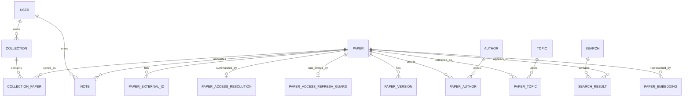

# Data Model

## Principles

- A scholarly work is distinct from provider records and accessible versions.
- Identifiers are normalized before uniqueness checks.
- Externally supplied fields retain provenance.
- Search snapshots are separate from canonical paper storage.
- User-owned data is isolated from shared metadata.
- PDF retention is explicit and never inferred from a URL alone.

## Main entities

## Core tables

### `paper`

| Column | Type | Notes |
|---|---|---|
| `id` | UUID | Internal stable identifier |
| `title` | TEXT | Selected canonical title |
| `normalized_title` | TEXT | Deduplication/search value |
| `abstract_text` | TEXT nullable | Canonical abstract |
| `publication_date` | DATE nullable | Full date when known |
| `publication_year` | SMALLINT nullable | Indexed filter |
| `document_type` | VARCHAR | Article, preprint, thesis, dissertation, etc. |
| `language` | VARCHAR nullable | Standard code when known |
| `venue_name` | TEXT nullable | Venue display name |
| `citation_count` | INTEGER nullable | Time-varying/source-qualified |
| `citation_count_as_of` | TIMESTAMPTZ nullable | Freshness marker |
| `metadata_quality` | NUMERIC | Explainable confidence/completeness |
| `created_at`, `updated_at` | TIMESTAMPTZ | Audit timestamps |

Indexes cover normalized title, year, type, PostgreSQL full text, and external identifiers.

### `paper_external_id`

Stores normalized DOI, arXiv, OpenAlex, PMID, PMCID, CORE, and repository-local IDs. A unique constraint on `(id_type, namespace, normalized_value)` prevents exact-identifier duplicates while allowing different repositories to reuse local IDs.

### `paper_version`

| Column | Purpose |
|---|---|
| `paper_id` | Canonical work |
| `source`, `source_location_key` | Provider provenance plus a stable SHA-256 location identity |
| `active`, `is_best` | Current-source membership and provider preference |
| `version_type` | Published, accepted manuscript, submitted manuscript, preprint, or unknown |
| `host_type` | Publisher, repository, preprint server, or unknown |
| `landing_url` | Verified human-facing page |
| `pdf_url` | Direct link only after a bounded PDF probe succeeds |
| `host_domain` | Provenance/policy evaluation |
| `access_status` | Open PDF, repository, restricted, unknown, etc. |
| `license_code` | Licence when available |
| `content_handling` | `LINK_ONLY` in the current implementation |
| `verification_*` | Verification status, HTTP status, content type/failure code, and time |
| `provider_updated_at`, `retrieved_at`, `last_seen_at` | Provider and local freshness evidence |
| `retention_allowed` | Database-enforced `false` for this link-only milestone |

`(paper_id, source, source_location_key)` is unique. A committed refresh deactivates the participating providers' previously active locations before applying newly verified evidence, without deleting historical rows. If no newly reported candidate can be verified and a compatible older resolution exists, it is returned unchanged as an explicit `STALE_FALLBACK` instead of being renewed as fresh.

### `paper_access_resolution`

One row per canonical paper stores the current overall access status, `checked_at`, `fresh_until`, a SHA-256 lookup fingerprint over access-relevant paper metadata, bounded provider-coverage JSON, warnings, and an optimistic-lock version. The current default freshness window is 24 hours. Fresh reads return `CACHE_HIT`; identifier/abstract-presence enrichment invalidates an incompatible cache entry, and a provider outage or failed candidate re-verification can serve a compatible stored result as `STALE_FALLBACK` without advancing its timestamps.

The implemented status vocabulary includes open PDF, open landing page, repository copy, preprint, abstract-only, restricted, unknown, and unavailable. A result with no supported DOI or arXiv identifier is cached with `NO_SUPPORTED_IDENTIFIER` rather than repeatedly calling inapplicable providers.

### `paper_access_refresh_guard`

One row per paper stores `last_forced_at`. An atomic PostgreSQL upsert claims a forced refresh only when the configurable cooldown has elapsed, so concurrent or repeated bypass requests cannot multiply provider traffic. The current default cooldown is five minutes.

### Provider, author, and topic data

- `provider_record`: provider, external ID, bounded raw metadata, retrieval time, mapping version.
- `author` and `paper_author`: normalized names, ORCID, ordering, optional institution.
- `topic` and `paper_topic`: provider/user/system topics with provenance and confidence.

## Search cache

### `search`

- Original and normalized query.
- SHA-256 fingerprint over query plus sorted filters.
- Validated filter JSONB.
- Status, search/freshness timestamps.
- Provider coverage and warnings.
- Initiating user after multi-user support.

### `search_result`

- Search ID and paper ID.
- Renderable JSONB paper projection captured at search time, so later catalog enrichment cannot rewrite old responses.
- Stable rank in that snapshot.
- Total score and feature-level explanation.
- Provider contribution set.

Exact fresh fingerprints reuse snapshots. Related-topic searches retrieve canonical papers independently and are not labelled exact hits.

The current implementation keeps successful snapshots immutable, retains canonical-paper references with delete protection, indexes fingerprint plus freshness, caches empty result sets, and creates a new snapshot for forced or stale refreshes. Provider failures can serve the latest exact stale snapshot with an explicit warning; they never overwrite it.

## Library

- `app_user`: local identity initially; external subject/tenant later.
- `collection`: owner, name, description, visibility, timestamps.
- `collection_paper`: collection, paper, reading status, position, timestamp.
- `note`: owner, paper, optional page/selection, Markdown text.
- `highlight`: owner, paper version, page, rectangles/text quote, color.

All user-owned tables include owner-aware constraints and authorization tests.

## Embeddings

`paper_embedding` stores paper ID, content kind, model/provider and revision, dimension, content checksum, vector, and timestamp. New models create new rows rather than mixing vector spaces. The MVP launches without embeddings; lexical search establishes an evaluation baseline first.

## Jobs and operations

- `job_run`: type, state, attempt, lease owner, schedule, timestamps, error code.
- `provider_request`: provider, operation, outcome, latency, result count, rate-limit metadata, correlation ID.
- `audit_event`: principal, action, target, outcome, safe metadata.
- `outbox_event`: reliable post-commit events if async processing is added.

## Retention

- Canonical metadata: retained while referenced, with source timestamps.
- Search snapshots: initially 90 days.
- Provider diagnostics: initially 30 days, without secrets/full payloads.
- Library/notes: until user deletion.
- PDFs: not stored by default; retained only when policy/licence permits.
- Derived embeddings: deleted with disallowed/deleted source content.

## Migrations

- Flyway owns production schema changes.
- `V1` creates canonical papers and identifiers; `V2` adds provider records/authors; `V3` adds immutable search snapshots; `V4` adds `paper_access_resolution` and `paper_version`; `V5` adds access lookup fingerprints and the persistent forced-refresh guard.
- Applied migrations are immutable.
- Destructive migrations require backup and roll-forward plans.
- Hibernate validates but does not create production tables.
