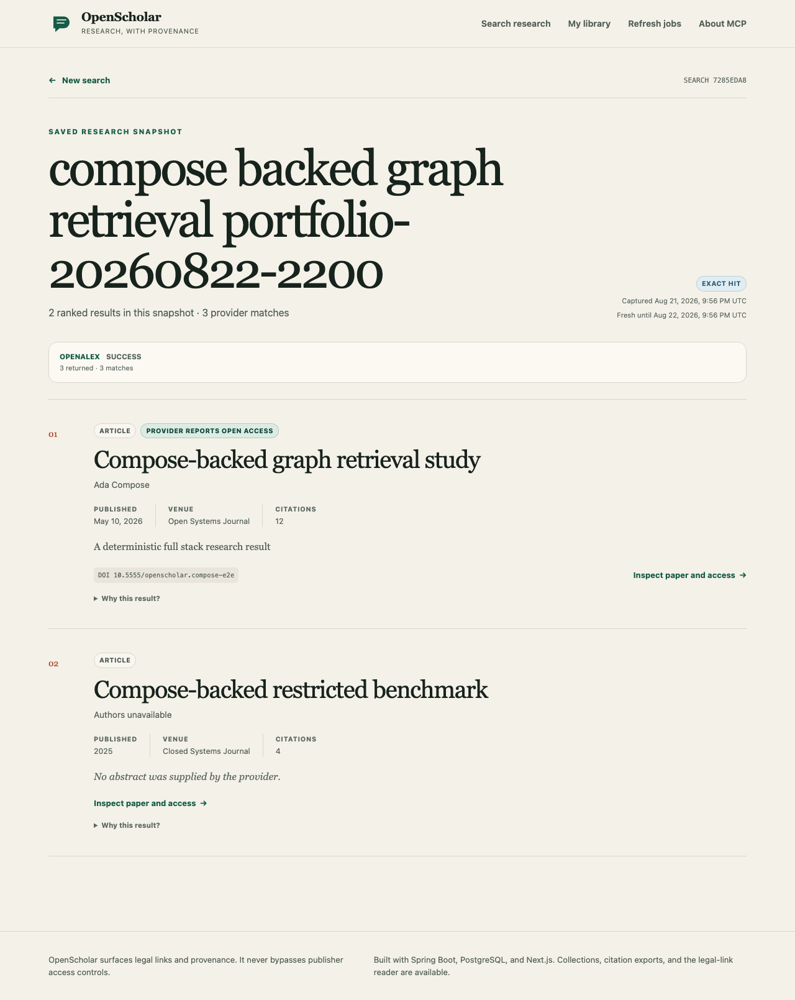
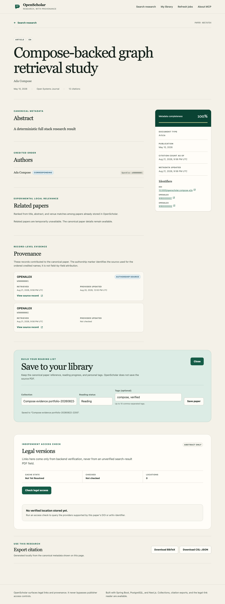
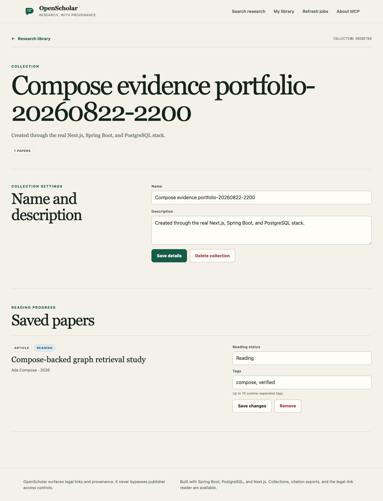

# Portfolio demo evidence

These screenshots come from the deterministic isolated Compose workflow, not from mocked React components. The workflow drives the production Next.js build against Spring Boot and PostgreSQL, with a metadata-only OpenAlex fixture. It verifies cold and cached HTTP semantics, exact DOI deduplication, canonical paper details/provenance, collection persistence, citation download, and serious/critical WCAG 2.2 axe findings before capturing the pages.

## Deduplicated search results



## Canonical paper and provenance



## Persisted research collection



## Reproduce

With the isolated E2E Compose stack running on the documented ports:

```bash
cd frontend
PORTFOLIO_SCREENSHOT_DIR=../docs/images \
PLAYWRIGHT_COMPOSE_ORIGIN=http://127.0.0.1:3300 \
pnpm test:e2e:compose
```

The screenshot hook is disabled unless `PORTFOLIO_SCREENSHOT_DIR` is set, so normal CI runs do not modify the checkout. The fixture contains synthetic metadata and no PDF document bytes.
